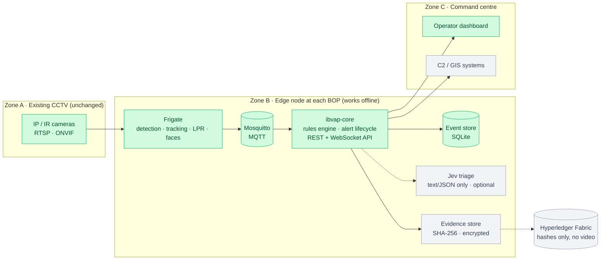
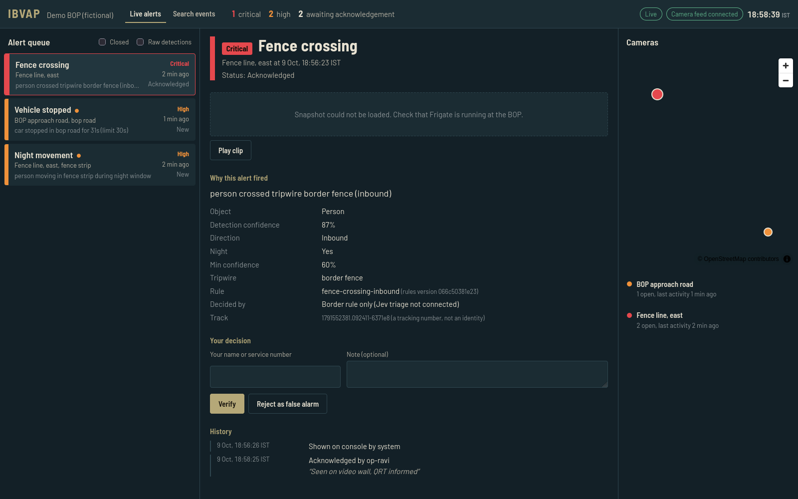
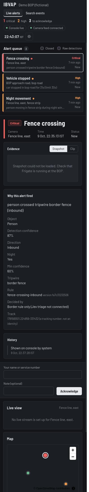

# IBVAP — Intelligent Border Video Analytics Platform

**Smart India Hackathon 2026 · PS 26187 · Ministry of Home Affairs / Sashastra Seema Bal**
**Team LUNATIQ22719 (Team ID 122202) · Theme: Blockchain & Cybersecurity**

IBVAP is software-only AI video analytics for the IP CCTV cameras already installed at Border Out Posts (BOPs). It needs no new cameras and no proprietary hardware: one small computer per BOP detects people and vehicles, applies border rules (virtual fence, night movement, loitering and more), raises explainable alerts in real time, keeps working offline, and makes evidence tamper-evident on a permissioned blockchain.

> **For evaluators:** everything under [See it working](#see-it-working) is real output from our code, captured on a development laptop. No clone or setup is needed to review progress. Each section says exactly what was tested and what is still pending.

---

## Progress

*Last updated: 9 October 2026*

| # | Component | Status | Evidence |
|---|---|---|---|
| 0 | Repo, shared event schema, CI, licence register | ✅ Done | [Event schema](ibvap-core/src/ibvap_core/schemas/event.py), [licences](docs/LICENSES.md) |
| 1 | Camera ingestion + detection (Frigate, MQTT, test streams) | 🟡 Running with a live camera (laptop webcam); looped test videos pending | [Live camera check](#6-live-camera-frigate) |
| 2 | ibvap-core: event ingestion, storage, alert lifecycle, REST + WebSocket API | ✅ Done | [Live run](#2-live-run-sample-frigate-events--alerts) |
| 3 | Border rules engine (8 rules: fence, night, loitering, …) | ✅ Done | [Rules](#border-rules-implemented), [tests](#1-automated-tests) |
| 4 | SSB operator dashboard (React): live alert queue, evidence, actions, map, search | ✅ Done | [Screenshots](#operator-dashboard) |
| 5 | Evidence hashing + Hyperledger Fabric ledger + "verify evidence" | ⏳ Planned | — |
| 6 | Jev (TypeSafe AI) triage with offline fallback | ⏳ Planned | Fallback field already in every event |
| 7 | Offline store-and-forward sync, edge → command centre (mTLS) | ⏳ Planned | Duplicate-safe event IDs already in place |
| 8 | ANPR (Indian plates), face detection (off by default), night tuning | 🟡 Partial | Plate reads + low-confidence review flag done |
| 9–10 | Security hardening, measured benchmarks, demo script | ⏳ Planned | — |

Full plan: [docs/DEVELOPMENT_PLAN.md](docs/DEVELOPMENT_PLAN.md)

**Honest status:**
- **Tested end to end with replayed events:** the backend, rules engine and dashboard, over a real MQTT broker. The events are in Frigate's exact message format, replayed by our script ([`publish_sample_events.py`](ibvap-core/scripts/publish_sample_events.py)).
- **Live camera, verified:** Frigate runs on a live camera stream and detects on the CPU. ibvap-core serves Frigate's real snapshots and clips to the dashboard.
- **Not yet captured:** a full person-walks-past-the-camera run with a measured camera-to-alert latency. That is next.

---

## Architecture



Green = built and tested · amber = next · grey = planned.

- **Frigate** (MIT, used unmodified via its Docker image) handles camera streams and object detection.
- **Our original work:** the border rules engine, alert lifecycle and API, Jev triage with offline fallback, the blockchain Trust Layer, offline sync, and the operator dashboard.

---

## Operator dashboard

Real screenshots of our dashboard (`dashboard/`), captured on **9 Oct 2026 at 18:58 IST** against ibvap-core with the sample events from our replay script. The operator name and plate are fictional.



What the screenshot shows:

- **Alert queue (left):** ranked by severity. The critical fence crossing is at the top. The **Vehicle stopped** alert was raised on its own by the rules timer after the sample car stood still for 31 s (limit 30 s). A dot marks alerts nobody has acknowledged yet.
- **Alert detail (centre):**
  - **Why this alert fired:** direction, night flag, thresholds, rule and rules version, and who decided ("Border rule only", because Jev is not connected yet).
  - **Actions:** the operator has acknowledged it, so the next actions offered are **Verify** or **Reject as false alarm**.
  - **History:** every action, with the operator's name and note.
- **Camera map (right):** each camera is coloured by its most severe open alert; clicking a camera filters the queue.
- **Header:** live connection, camera-feed status and IST clock.

What is not shown yet, and why:

- The snapshot area says *"Snapshot could not be loaded"* because Frigate is not running yet (Phase 1). The console proxies snapshots and clips from Frigate through ibvap-core, and this path is covered by automated tests.
- The map's OpenStreetMap background did not load in this headless-browser capture. The camera markers show anyway, which is also how the map behaves offline at a BOP.

<details>
<summary>Phone / narrow-screen layout</summary>



</details>

---

## See it working

Sections 2–5 were captured on **9 Oct 2026 at 01:06 IST**, on a development laptop: Fedora Linux, Python 3.12, Mosquitto 2.0.20 in Docker. Because it was night in IST, night-time severity rules applied. Section 1 was re-run when the dashboard was added.

### 1. Automated tests

Re-run on 9 Oct 2026 at 18:59 IST. There are 78 tests in total, all passing:
- **71 backend tests:** event schema, Frigate message mapping, storage and lifecycle, geometry, all 8 border rules (with synthetic movement tracks), and the API, WebSocket and media proxy.
- **7 dashboard tests:** alert ranking, live updates and the lifecycle actions offered.

```text
$ cd ibvap-core && uv run pytest
tests/test_api.py ............                                           [ 16%]
tests/test_event_schema.py ...............                               [ 38%]
tests/test_frigate_mapper.py .........                                   [ 50%]
tests/test_geometry.py ......                                            [ 59%]
tests/test_rules_engine.py .......................                       [ 91%]
tests/test_store.py ......                                               [100%]
71 passed

$ cd dashboard && npm test
 Test Files  1 passed (1)
      Tests  7 passed (7)
```

### 2. Live run: sample Frigate events → alerts

**Scenario:** a person walks from beyond the border fence across it into the fence strip, at night, on camera `cam-fence-east`. At the same time a car with a (fictional) number plate appears on the BOP road camera.

**ibvap-core starts, loads the border rules, and subscribes to Frigate's MQTT topic:**

```text
$ uv run uvicorn ibvap_core.api:create_app --factory --port 8000
INFO ibvap_core.api: loaded 2 camera rule sets from config/rules.yaml (version 066c50381e23)
INFO ibvap_core.mqtt_consumer: subscribed to frigate/events on localhost
```

**Frigate-format events are published to MQTT:**

```text
$ uv run python scripts/publish_sample_events.py
published new    person 1791488193.220633-1794b6
published new    car    1791488193.220653-1f467d
published update person 1791488193.220633-1794b6
published update person 1791488193.220633-1794b6
published update car    1791488193.220653-1f467d
published end    person 1791488193.220633-1794b6
```

**The rules engine raises alerts (server log):**

```text
INFO ibvap_core.pipeline: alert critical tripwire_crossing on cam-fence-east: person crossed tripwire border_fence (inbound)
INFO ibvap_core.pipeline: alert high night_movement on cam-fence-east: person moving in fence_strip during night window
```

**What an operator console receives live over WebSocket (`/ws/alerts`):**

```text
snapshot       (0 open alerts)
event.created  informational detection          cam-fence-east  status=generated
event.updated  informational detection          cam-fence-east  status=delivered
event.created  informational detection          cam-bop-road    status=generated
event.updated  informational detection          cam-bop-road    status=delivered
event.created  critical      tripwire_crossing  cam-fence-east  status=generated
event.updated  critical      tripwire_crossing  cam-fence-east  status=delivered
event.created  high          night_movement     cam-fence-east  status=generated
event.updated  high          night_movement     cam-fence-east  status=delivered
```

An alert is marked **delivered** only after a console has actually received it.

**Alert queue ranked by severity (`GET /events?order=severity`):**

| Severity | Event type | Camera | Plate | Why it fired |
|---|---|---|---|---|
| **critical** | tripwire_crossing | cam-fence-east | — | person crossed tripwire border_fence (inbound) |
| **high** | night_movement | cam-fence-east | — | person moving in fence_strip during night window |
| informational | detection | cam-bop-road | MH12ZZ0001 ⚠ needs review | Frigate detected car (score 0.87) |
| informational | detection | cam-fence-east | — | Frigate detected person (score 0.87) |

The plate was read at 64% confidence, below the 80% threshold, so it is flagged for human review.

### 3. Explainable alert record

The full record for the critical fence-crossing alert (`GET /events/{id}`). It shows **which rule fired, which version of the rules, the direction, the night flag and the exact path segment that crossed the fence**. No images are stored in events; snapshot and clip are references only.

```json
{
  "schema_version": "1.0.0",
  "event_id": "b24780e5-10c7-5620-98b4-33b203bde11b",
  "site_id": "BOP-DEMO-01",
  "camera_id": "cam-fence-east",
  "event_type": "tripwire_crossing",
  "severity": "critical",
  "timestamp": "2026-10-08T19:36:35.220658Z",
  "object_type": "person",
  "tracking_id": "1791488193.220633-1794b6",
  "detection_confidence": 0.87,
  "direction": "inbound",
  "snapshot_ref": "frigate:/api/events/1791488193.220633-1794b6/snapshot.jpg",
  "clip_ref": "frigate:/api/events/1791488193.220633-1794b6/clip.mp4",
  "versions": { "model": null, "rule_id": "fence-crossing-inbound", "rule_version": "066c50381e23" },
  "explanation": {
    "summary": "person crossed tripwire border_fence (inbound)",
    "parameters": {
      "rule_type": "tripwire",
      "night": true,
      "min_confidence": 0.6,
      "tripwire": "border_fence",
      "from": [0.5, 0.35],
      "to": [0.5, 0.55],
      "frigate_event_id": "1791488193.220633-1794b6"
    }
  },
  "jev_decision": null,
  "decision_source": "rules_fallback",
  "status": "escalated",
  "evidence_hash": null,
  "ledger_tx_id": null,
  "sync_status": "pending"
}
```

`jev_decision`, `evidence_hash` and `ledger_tx_id` are empty because Jev triage (Phase 6) and the blockchain Trust Layer (Phase 5) are not built yet. `decision_source: rules_fallback` shows the alert came from deterministic rules alone, which is how critical alerts keep working with no internet.

### 4. Human-in-the-loop alert lifecycle with audit trail

An operator acknowledges, a supervisor verifies and escalates. Invalid steps are refused.

```text
$ curl -X POST /alerts/<id>/ack       {"actor": "op-ravi"}     → status: acknowledged
$ curl -X POST /alerts/<id>/verify    {"actor": "sup-meena"}   → status: verified
$ curl -X POST /alerts/<id>/escalate  {"actor": "sup-meena"}   → status: escalated
$ curl -X POST /alerts/<id>/ack       (again)
{"detail":"escalated -> acknowledged is not allowed"}          → HTTP 409
```

Audit trail (`GET /events/{id}/audit`, times in UTC):

| From | To | By | Note | At |
|---|---|---|---|---|
| generated | delivered | system:ws | — | 19:36:34.735 |
| delivered | acknowledged | op-ravi | Seen on video wall | 19:36:39.372 |
| acknowledged | verified | sup-meena | Confirmed on clip: one person crossing | 19:36:39.389 |
| verified | escalated | sup-meena | Escalated to company HQ | 19:36:39.408 |

Operator names are fictional. From Phase 5, these transitions are hashed onto the blockchain ledger.

### 5. Processing latency

`GET /metrics/latency` over the 4 events delivered in this run:

| Stage | p50 | p95 |
|---|---|---|
| MQTT message → received by ibvap-core | 1.0 ms | 1.2 ms |
| Received → rules applied and stored | 3.1 ms | 4.9 ms |
| Stored → pushed to operator console | 0.7 ms | 1.3 ms |
| **Total inside ibvap-core** | **5.0 ms** | **6.6 ms** |

**What this number does and does not include:** it is IBVAP's own processing time only. Camera streaming and Frigate's detection time are not included, because no live camera was used. Our design target is under 2 s from camera frame to alert at the edge. Frigate now runs on a live camera (see section 6), and the end-to-end figure is the next measurement.

### 6. Live camera (Frigate)

Checked on **9 Oct 2026, 19:41–19:45 IST** with the full edge stack running in Docker Compose ([`deploy/docker-compose.yml`](deploy/docker-compose.yml)). The camera is the laptop webcam, published by MediaMTX as an RTSP stream exactly like an IP camera. No webcam images are reproduced here.

| Check | Result |
|---|---|
| Frigate version | 0.18.0, official image, pinned by digest |
| Object detector | OpenVINO, SSDLite MobileNet v2, on the laptop CPU (AMD Ryzen 5 7535HS) |
| Detector inference time | **10 ms per frame** (Frigate `/api/stats`) |
| Camera stream | 1280×720 from MediaMTX over RTSP; Frigate processing at 5 fps |
| Snapshot and clip from Frigate for a live-camera event | 200 OK, JPEG 63 KB and MP4 7.6 MB |
| Same snapshot and clip served to the dashboard through ibvap-core (`/media/{alert}/…`) | 200 OK, `image/jpeg` and `video/mp4` |

We confirmed the media path by sending a Frigate-format message for a real Frigate event (made with Frigate's manual-event API) through the rules engine. It raised `critical tripwire_crossing on cam-gate-west` at night, and the dashboard path served that event's real snapshot and clip.

**Not shown yet:** an alert caused by a person actually walking past the camera, and the camera-to-alert latency for it. Both are the next measurements, and we will publish them here.

---

## Border rules implemented

Configured per camera in [`ibvap-core/config/rules.yaml`](ibvap-core/config/rules.yaml). All rules are deterministic, explainable, and never depend on the network or Jev.

| Rule | Fires when | PS capability |
|---|---|---|
| `tripwire` | A person or vehicle crosses a virtual fence line, in a chosen direction (inbound / outbound) | Virtual fence intrusion |
| `zone_entry` | Something enters a restricted zone | Virtual fence intrusion |
| `night_movement` | Any person or vehicle in a zone during the night window (18:30–06:00 IST by default), with a lower confidence threshold | Night-time movement |
| `loitering` | Someone stays in a zone longer than a set time | Suspicious activity |
| `approach_retreat` | Someone repeatedly approaches and backs away from the fence | Suspicious activity |
| `vehicle_stopped` | A vehicle stops in a sensitive area | Suspicious activity |
| `wrong_direction` | Movement against the permitted direction (e.g. one-way road) | Suspicious activity |
| `group_forming` | Several people gather in a restricted zone | Suspicious activity |

Every rule can be set per camera:
- which objects it applies to
- minimum confidence, with a separate threshold at night
- severity, with a separate severity at night
- schedule: always, night or day
- cooldown, so one event doesn't flood the queue

Example from the demo configuration (coordinates are fractions of the camera frame, so they work at any resolution):

```yaml
cam-fence-east:
  tripwires:
    border_fence:
      points: [[0.0, 0.42], [1.0, 0.42]]
      inbound_point: [0.5, 0.9]        # any point on the Indian side
  rules:
    - id: fence-crossing-inbound
      type: tripwire
      tripwire: border_fence
      direction: inbound
      min_confidence: 0.6
      night_min_confidence: 0.45       # more sensitive at night
      severity: high
      night_severity: critical         # night crossing → Critical
      cooldown_s: 30
```

Each alert records a version hash of the rules file, so any rule change can be traced. From Phase 5 that hash also goes on the ledger.

---

## Design principles

- **No new hardware:** works with existing RTSP/ONVIF cameras and one edge computer per BOP.
- **Offline first:** detection, rules and alerts run entirely at the BOP. Event IDs are deterministic, so syncing to the command centre later cannot create duplicates.
- **Human in the loop:** the system recommends and people decide. Every action is attributed and audited.
- **Privacy by design (DPDP Act 2023):**
  - Face recognition is off by default and only for an authorised watchlist.
  - Event records have a fixed schema with no image fields; snapshots and clips are stored only as references.
  - Jev receives only text/JSON descriptions, never frames, faces or plates.
- **Tamper-evident evidence (planned, Phase 5):** SHA-256 hashes of events, clips and rule changes are anchored on Hyperledger Fabric. No video or personal data goes on-chain.
- **Explainable:** every alert says which rule fired, the measured values and the rule version.

---

## Run it yourself

The short version is below. For a full step-by-step guide, including installing prerequisites, running without a webcam, troubleshooting and resetting data, see **[SETUP.md](SETUP.md)**.

**Prerequisites:**
- Linux, with Python 3.12, [uv](https://docs.astral.sh/uv/), Node.js 22, Docker and the Docker Compose plugin
- about 10 GB of free disk for the Frigate image
- a webcam at `/dev/video0` for the live camera

**1. Start the edge stack:** the MQTT broker, the webcam as an RTSP camera, and Frigate.

```bash
cd IBVAP-Intelligent-Border-Video-Analytics-Platform
docker compose -f deploy/docker-compose.yml up -d
docker compose -f deploy/docker-compose.yml ps        # all three should be "running"
```

**2. Build the dashboard (once):**

```bash
cd dashboard && npm install && npm run build && cd ..
```

**3. Start ibvap-core** in its own terminal, from any folder. Wait for `loaded 3 camera rule sets` and `subscribed to frigate/events`.

```bash
cd ibvap-core
uv sync
uv run uvicorn ibvap_core.api:create_app --factory --port 8000
```

**4. Make something happen:**
- **Live:** walk across the webcam's view from left to right. That crosses the virtual gate line on `cam-gate-west` inbound, and it is a Critical alert at night.
- **Without a camera:** `cd ibvap-core && uv run python scripts/publish_sample_events.py` replays scripted Frigate events for the two demo cameras.

**In a browser:**

| URL | What you see |
|---|---|
| http://127.0.0.1:8000/ui/ | **Operator dashboard:** live alerts with snapshots and clips, actions, map, search |
| http://127.0.0.1:8971 | Frigate's own UI (live view, detections). User `admin`; the first-run password is in `docker compose -f deploy/docker-compose.yml logs frigate \| grep Password` |
| http://127.0.0.1:8000/docs | Interactive API: try every endpoint, including ack / verify / escalate |
| http://127.0.0.1:8000/health | Rules version, MQTT connection, connected consoles |
| http://127.0.0.1:8000/metrics/latency | Processing latency |

**Run the tests:** `cd ibvap-core && uv run pytest` and `cd dashboard && npm test`

**Stop everything:** Ctrl+C in the ibvap-core terminal, then `docker compose -f deploy/docker-compose.yml down`. Closing the terminal is not enough; see [STOPPING.md](STOPPING.md).

**Notes:**
- To run ibvap-core in a container too, add `--profile core` to the `up` command and skip step 3.
- All ports listen on 127.0.0.1 only.
- Frigate detects only when something moves. An empty, still room produces no events, which is expected.

Full API reference: [ibvap-core/README.md](ibvap-core/README.md). Camera and detector setup: [frigate/README.md](frigate/README.md).

---

## Repository layout

| Folder | Purpose | Status |
|---|---|---|
| [`ibvap-core/`](ibvap-core/) | Backend: MQTT ingestion, rules engine, alert lifecycle, REST/WebSocket API | ✅ Working |
| [`deploy/`](deploy/) | Docker Compose edge stack: MQTT broker, MediaMTX camera streams, Frigate, ibvap-core | ✅ Working |
| [`docs/`](docs/) | Development plan, event JSON Schema, licence register | ✅ |
| [`frigate/`](frigate/) | Frigate camera / detector configuration | ✅ Live webcam camera |
| [`dashboard/`](dashboard/) | React operator dashboard | ✅ Working |
| [`trust-layer/`](trust-layer/) | Hyperledger Fabric network + chaincode | ⏳ Phase 5 |
| [`samples/`](samples/) | Test footage we have rights to use | ⏳ Clips to be recorded |

---

## Credits and licences

- **[Frigate](https://github.com/blakeblackshear/frigate)** (MIT): camera ingestion and detection, used unmodified via its official Docker image.
- **[Eclipse Mosquitto](https://mosquitto.org/)** (EPL-2.0 / EDL-1.0): MQTT broker.
- **[MediaMTX](https://github.com/bluenviron/mediamtx)** (MIT): publishes local video sources as RTSP camera streams for development.
- **[OpenVINO](https://github.com/openvinotoolkit/openvino)** (Apache-2.0) with the SSDLite MobileNet v2 model, both bundled in the Frigate image: CPU object detection.
- **[FastAPI](https://fastapi.tiangolo.com/)**, **SQLAlchemy**, **Pydantic**, **aiomqtt**: backend libraries (MIT / BSD).
- **[React](https://react.dev/)** (MIT), **[MapLibre GL JS](https://maplibre.org/)** (BSD-3), **Barlow** typeface (OFL), map data © [OpenStreetMap](https://www.openstreetmap.org/copyright) contributors: dashboard.
- **Planned:** [Hyperledger Fabric](https://hyperledger-fabric.readthedocs.io/) (Apache-2.0), Jev by [TypeSafe AI](https://typesafe.ai) (commercial API).

Every component and its licence is listed in [docs/LICENSES.md](docs/LICENSES.md). We do not use AGPL-licensed detection packages. All code in this repository is our own work. Demo data (plates, names, sites) is fictional.
